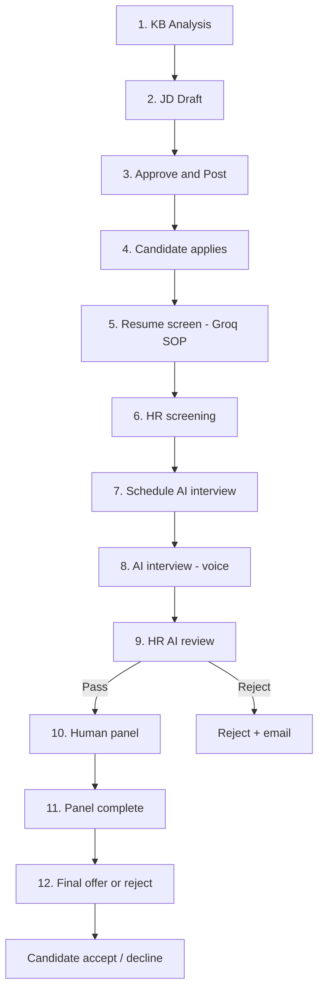

# Full Hiring Flow — 12 Steps

This is the authoritative map of NeuroHR AI hiring: every step, which page to open, and which API fires. It matches `frontend/src/lib/hiringPipeline.ts` and the Express routes in `backend-express/src/routes/jobs.js`.

---

## Visual pipeline

---

## Rules that matter

| Topic | Behavior |
|-------|----------|
| **Auto-reject on score** | **No** — HR decides at screening, AI review, and final decision |
| **Auto-shortlist** | **Yes** — screening ≥ **80%** → status `shortlisted`, candidate notified |
| **Composite score** | **80% resume + 20% AI interview** (shown after interview) |
| **AI interview eval** | **Groq only** (`harness_groq`) — no heuristic fallback |
| **Human panel** | Only after HR **Pass** on AI interview (Checkpoint 3) |
| **Offer** | Only after human panel marked **completed** |
| **Offer response** | Candidate can accept or decline via Job Openings |

---

## Step 1 — KB analysis

| | |
|---|---|
| **Page** | Post Jobs (`/dashboard/jobs`) |
| **ML** | `knowledgebase.py` + `repo_analyzer.py` — reads `knowledgebase/INDEX.md` and `catalog/*.md` |
| **Output** | Tech stack profile for JD generation |

---

## Step 2 — JD draft

| | |
|---|---|
| **Page** | Post Jobs |
| **UI** | Role title, experience, department → **Generate JD from Knowledge Base** |
| **ML** | `jd_generator.py` — map skills → draft → serialize → interview questions |
| **Output** | Job saved as **`draft`** — not visible to candidates |

Manual paste also saves as **`draft`** until approved.

---

## Step 3 — Approve & post

| | |
|---|---|
| **Page** | Post Jobs |
| **API** | `POST /jobs/:id/approve`, `POST /jobs/:id/reject-draft` |
| **UI** | Edit in TipTap → **Approve & Post Job** |
| **Gate** | Only `status: open` jobs appear on Job Openings |

---

## Step 4 — Candidate applies

| | |
|---|---|
| **Page** | Job Openings (`/dashboard/job-openings`) |
| **API** | `POST /jobs/:id/apply` |
| **Data** | Resume stored on `JobApplication`; inline Groq screening runs |

---

## Step 5 — Resume screen

| | |
|---|---|
| **ML** | `resume_screener.py` — fresher 10-step / experienced 8-step SOP |
| **Score** | `total_score` /100, dimensions, verdict, gaps |
| **Gate** | All applications land in HR inbox — **no auto-reject** |
| **UI** | `ScreeningResultCard` on Applications inbox |

---

## Step 6 — HR screening

| | |
|---|---|
| **Page** | Applications (`/dashboard/applications`) |
| **Auto** | ≥80% → `shortlisted` + notification (`finalizeApplicationAfterScreening`) |
| **Manual** | HR can shortlist or reject with reason |
| **API** | `PATCH /jobs/applications/:id/status` |
| **Gate** | Must be **shortlisted** before AI interview schedule |

---

## Step 7 — Schedule AI interview

| | |
|---|---|
| **Page** | Applications |
| **API** | `POST /interviews/schedule` |
| **ML** | `interview_question_generator.py` — **15 tailored questions** |
| **Email** | HR OAuth — `interviewScheduled` → My Interview |

---

## Step 8 — AI interview

| | |
|---|---|
| **Page** | My Interview (`/dashboard/interviews`) |
| **Session** | ~**30 minutes**, voice, camera frames optional |
| **API** | `POST /interviews/:id/submit` → `interview_evaluator.py` |
| **Scoring** | Technical 35%, Problem Solving 25%, Communication 20%, Culture 10%, Experience 10% |
| **Composite** | `0.8 × screening + 0.2 × interview` → `finalScore` |
| **Gate** | Sets `aiInterviewReview.decision: pending` — **no auto-reject** |

---

## Step 9 — HR AI review (Checkpoint 3)

| | |
|---|---|
| **Page** | Applications |
| **API** | `POST /jobs/applications/:id/ai-interview-decision` — `{ decision: qualified \| reject }` |
| **Email** | Pass notice or `interviewRejected` on reject |

---

## Step 10 — Human panel

| | |
|---|---|
| **Page** | Applications (after Pass only) |
| **API** | `POST /jobs/applications/:id/schedule-human-interview` |
| **UI** | Multi-interviewer form, Google Meet link (Calendar OAuth) |
| **Email** | Candidate invite + per-interviewer briefing (`interviewerBriefing.js`) |
| **Gate** | `aiInterviewReview.decision === qualified` |

---

## Step 11 — Panel complete

| | |
|---|---|
| **Page** | Applications |
| **API** | `POST /jobs/applications/:id/complete-human-interview` |
| **UI** | **Mark panel complete** — unlocks final decision |
| **Gate** | Required before offer email |

---

## Step 12 — Final decision

| | |
|---|---|
| **Page** | Applications / Job Openings (candidate view) |
| **API** | `POST /jobs/applications/:id/final-decision` |
| **Candidate** | `POST /jobs/applications/:id/offer-response` — accept / decline |
| **Email** | `finalSelected` / `finalRejected`; Groq offer letter when configured |
| **Gate** | Human panel completed + HR AI pass |

---

## API quick reference

| Step | Endpoint |
|------|----------|
| KB JD | `POST /jobs/generate-from-kb` |
| Approve JD | `POST /jobs/:id/approve` |
| Apply | `POST /jobs/:id/apply` |
| HR status | `PATCH /jobs/applications/:id/status` |
| Schedule AI | `POST /interviews/schedule` |
| Submit interview | `POST /interviews/:id/submit` |
| HR AI review | `POST /jobs/applications/:id/ai-interview-decision` |
| Human panel | `POST /jobs/applications/:id/schedule-human-interview` |
| Panel done | `POST /jobs/applications/:id/complete-human-interview` |
| Final | `POST /jobs/applications/:id/final-decision` |
| Offer response | `POST /jobs/applications/:id/offer-response` |

---

## Pipeline navigation (UI)

- `HiringPipelineFlow.tsx` — all 12 steps are clickable  
- `getPipelineStepHref()` — recruiter vs candidate routes  
- Hash anchors (`#pipeline-step-N`) scroll on jobs, applications, job-openings, interviews pages  

---

## Demo credentials

- HR Admin: `vaishaleeaiml@gmail.com` / `123456`  
- Requires: `GROQ_API_KEY`, `KNOWLEDGEBASE_PATH=./knowledgebase`, ML `:8001`, Express `:8000`  
- Fresh DB: `npm run seed:force` in `backend-express/`  

---

## Related

- [Hiring Flow](./HIRING_FLOW.md) — narrative walkthrough  
- [ML Flow](./ML_FLOW.md) — pipeline internals  
- [Org KB Flow](./ORG_KB_FLOW.md) — knowledge base setup  
