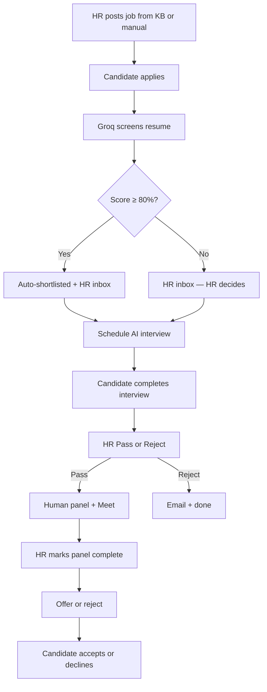

# Hiring Flow — From Job Post to Offer

This is how hiring works in NeuroHR AI, told the way you'd walk a new recruiter through the product on a Tuesday morning.

For the exact step numbers and APIs, see [Full Hiring Flow](./FULL_HIRING_FLOW.md).

---

## Who does what

| Person | Where they live in the app | Their part |
|--------|---------------------------|------------|
| **HR Recruiter** | Post Jobs, Applications, Screening | Writes roles, reviews candidates, schedules interviews, sends offers |
| **Candidate** | Job Openings, My Interview | Applies, takes the AI interview, responds to offers |
| **Senior Manager / Admin** | Same + Analytics | Can schedule interviews and see pipeline metrics |

Employees use Attendance and Payroll separately — unless they're also managers scheduling panels.

---

## The journey in one diagram

**Takeaway:** Scores help you prioritize. **You** reject or advance — the system doesn't silently drop candidates after screening or interview.

---

## Step 1 — Create a job from your org knowledge

**Who:** Recruiter or Admin  
**Where:** Post Jobs (`/dashboard/jobs`)

1. Enter role title, department, experience level.  
2. Click **Generate JD from Knowledge Base** — Groq reads your `knowledgebase/` repos and drafts a realistic description.  
3. Or paste a JD manually — it still starts as a **draft**.

Behind the scenes: `POST /jobs/generate-from-kb` → `jd_generator.py`.

---

## Step 2 — Approve and publish

Still on Post Jobs:

1. Review the draft in the rich-text editor.  
2. Click **Approve & Post Job**.  
3. The job goes **open** and appears on Job Openings.

Only open jobs accept applications.

---

## Step 3 — Candidate applies

**Who:** Candidate  
**Where:** Job Openings (`/dashboard/job-openings`)

1. Pick a role.  
2. Upload PDF or DOCX resume.  
3. Add a short cover note if they like.  
4. Submit.

The ML service parses the file and runs the Groq harness screening SOP. Every application shows up in the recruiter inbox with scores and skill gaps.

---

## Step 4 — Screening scores (and auto-shortlist)

| Score | What happens |
|-------|----------------|
| **≥ 80%** | Status becomes **shortlisted** automatically; candidate gets a notification |
| **Below 80%** | Stays in inbox for HR review — **not** auto-rejected |

**Tip for demos:** Use a resume that clearly matches the JD skills. A generic CV on a specialized role will score lower — that's realistic, and HR can still shortlist manually if they want.

---

## Step 5 — HR reviews the inbox

**Where:** Applications (`/dashboard/applications`)

You'll see:

- JD match score and dimension breakdown  
- Matched vs missing skills  
- The clickable **12-step pipeline** — jump to any stage  
- Actions: shortlist, reject, schedule AI interview (shortlisted only)

You can also bulk-import resumes from **Screening** (`/dashboard/screening`) — same scoring rules.

---

## Step 6 — Schedule the AI interview

**Who:** Recruiter, Senior Manager, or Admin

1. Choose the candidate.  
2. Set a **deadline** (must be in the future).  
3. Confirm.

Groq generates **15 tailored questions**. The candidate gets an email (HR OAuth) and an in-app notification. They must finish before the deadline or the slot expires.

---

## Step 7 — Candidate takes the interview

**Where:** My Interview (`/dashboard/interviews`)

1. Open the scheduled session before the deadline.  
2. Allow microphone (camera optional).  
3. Answer voice questions — about 30 minutes.  
4. Submit.

Groq evaluates every answer. **Composite score** = 80% screening + 20% interview. The application moves to **interview completed** with HR review **pending** — no automatic rejection.

---

## Step 8 — HR AI review (Checkpoint 3)

Back in Applications:

- **Pass** → unlocks human panel scheduling  
- **Reject** → candidate emailed and notified  

This is intentional friction: a borderline AI score doesn't end someone's process without a human looking.

---

## Step 9 — Human panel

After Pass:

1. Add interviewers, date/time, notes.  
2. System creates a **Google Meet** link (Calendar OAuth).  
3. Candidate and each panelist get emails; panelists get a **Groq briefing** on the candidate.

---

## Step 10 — Mark panel complete

When the live round is done, HR clicks **Mark panel complete**. Only then can you send an offer or final rejection.

---

## Step 11 — Final decision and offer response

**Recruiter:**

- **Selected** — enter compensation, start date, message → offer email (Groq letter when ML is up)  
- **Rejected** — templated rejection email  

**Candidate** (Job Openings):

- **Accept** or **Decline** the offer  
- Agent notifies HR of the response  

---

## Notifications

- Bell icon in the header — poll for new items  
- Toasts for interview scheduled, shortlist, rejection, offer  
- Emails are responsive HTML (mobile-friendly layouts)

---

## Common questions

**Why wasn't my candidate auto-shortlisted?**  
Screening score was below 80%. HR can still shortlist manually.

**Why can't I schedule an AI interview?**  
Application isn't shortlisted yet, or it was rejected by HR.

**Why can't I send an offer?**  
HR AI review must be **Pass**, and human panel must be **marked complete**.

**Why did payroll or leave say "saved but email failed"?**  
The record saved — fix OAuth (`npm run auth:calendar` / `auth:agent`) and retry. Those emails use templates, not Groq.

**Can I click through the pipeline steps?**  
Yes — the flow bar on Jobs, Applications, Job Openings, and Interviews links to each step.

---

## Five-minute demo script

| Step | Login | Action |
|------|-------|--------|
| 1 | `recruiter@neurohr.com` / `recruiter123` | Generate or approve a JD |
| 2 | `candidate@neurohr.com` / `candidate123` | Apply with a strong resume |
| 3 | Recruiter | See auto-shortlist if ≥80%; schedule AI interview |
| 4 | Candidate | Complete My Interview |
| 5 | Recruiter | Pass AI review → schedule panel → complete → offer |

---

## Related reading

- [Full Hiring Flow](./FULL_HIRING_FLOW.md) — APIs and gates  
- [ML Flow](./ML_FLOW.md) — how scores are computed  
- [Org KB Flow](./ORG_KB_FLOW.md) — knowledge base setup  
- [README](../README.md) — install and OAuth  
