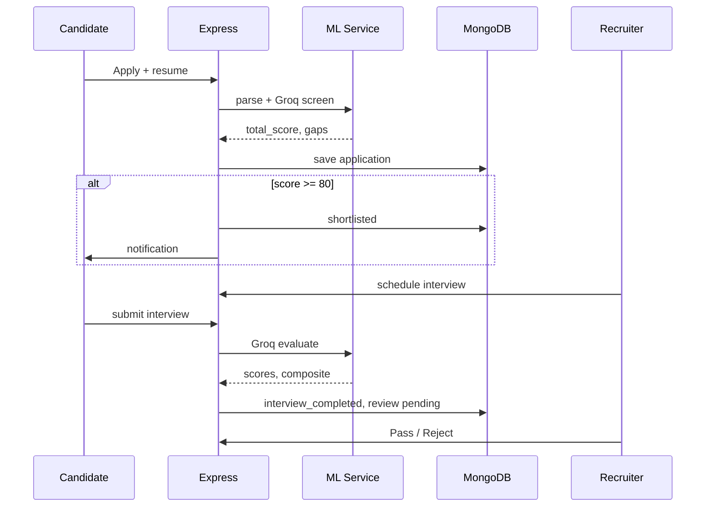

# ML Flow — How the AI Works

NeuroHR AI keeps the interesting ML in `ml-service/` (Python FastAPI). Express calls it, stores results in MongoDB, and handles auth, email, and HR gates.

**Today the product is Groq-first** for hiring: JD generation, resume SOP screening, interview questions, interview evaluation, and many HR emails. Optional OpenAI can still enrich some paths if configured, but don't assume it — check `groq_service.py` and `require_groq()` in each pipeline.

---

## Service map

```
Express (backend-express)              ML Service (ml-service)
        │                                      │
        ├─ POST /jobs/generate-from-kb ───────► /api/jd/generate-from-kb
        ├─ POST /jobs/:id/apply ──────────────► parse + harness screen
        ├─ POST /interviews/... ──────────────► interview eval (Groq)
        ├─ POST /chat/message ────────────────► /api/chat
        ├─ POST /payroll/calculate ───────────► payroll + anomaly
        ├─ POST /hr/generate-email ───────────► Groq emails (offers, etc.)
        └─ POST /ml/train ────────────────────► /api/ml/train-upload
```

**Health:** `GET http://localhost:8001/health`

If ML is down, apply, interviews, KB JD generation, and Groq emails fail. Payslip and leave emails still work — they use Express HTML templates.

---

## Pipeline 1 — Resume parsing

**File:** `resume_parser.py`  
**Endpoint:** `POST /api/resume/parse`

Extracts name, email, skills, experience from PDF/DOCX. Optional Tesseract for scanned PDFs.

If parsing can't find an email, the Screening page lets recruiters type one manually.

---

## Pipeline 2 — Harness resume screening (Groq SOP)

**File:** `resume_screener.py`  
**Endpoint:** `POST /api/resume/screen`

Runs fresher (10-step) or experienced (8-step) SOP. Returns:

- `total_score` /100  
- Dimension scores, verdict, key gaps  
- `escalate_to_human` for borderline cases  

**Express behavior** (`applicationService.js`):

- Saves application as `applied`  
- If score ≥ **80%** → auto-**shortlisted** (not rejected)  
- HR always sees everyone in the inbox  

---

## Pipeline 3 — Knowledge base → JD

**Files:** `knowledgebase.py`, `repo_analyzer.py`, `jd_generator.py`  
**Endpoint:** `POST /api/jd/generate-from-kb`

1. Read org catalog markdown  
2. Groq extracts tech stack for the role  
3. Map must-have vs nice-to-have skills  
4. Draft 7-section JD grounded in real repos  
5. Serialize metadata + generate interview question seeds  

Requires `GROQ_API_KEY` and `KNOWLEDGEBASE_PATH`.

---

## Pipeline 4 — JD analysis (manual jobs)

**File:** `jd_analyzer.py`  
**Endpoint:** `POST /api/jd/analyze`

When recruiters paste or edit a JD: extracted skills, suggested questions, salary hints.

---

## Pipeline 5 — Interview questions

**File:** `interview_question_generator.py`  

**15 Groq-tailored questions** per candidate when scheduling. Stored on the interview record.

---

## Pipeline 6 — Per-answer analysis (live)

**File:** `interview_analyzer.py`  
**Endpoint:** `POST /api/interview/analyze-answer`

Groq scores each answer: technical depth, communication, confidence, JD fit. Optional video frames add fluency/attention cues.

---

## Pipeline 7 — Full interview evaluation (Groq only)

**Files:** `interview_evaluator.py`, `interview_full_analyzer.py`  
**Endpoint:** `POST /api/interview/analyze-full`

On submit:

1. Groq evaluates all Q&A (`evaluation_method: harness_groq`)  
2. Weights: Technical 35%, Problem Solving 25%, Communication 20%, Culture 10%, Experience 10%  
3. **Composite** = `0.8 × screening + 0.2 × interview`  
4. `shortlistVerdict` when composite ≥ 50  

**Express** (`interviews.js` → `finalizeApplicationAfterInterview`):

- Status → `interview_completed`  
- `aiInterviewReview.decision` → **`pending`**  
- HR notified — **no auto-reject**  

Non-`harness_groq` evaluations are rejected by the API.

---

## Pipeline 8 — HR emails (Groq)

**File:** `hr_email_generator.py`  
**Endpoint:** `POST /api/hr/generate-email`

Groq generates subject + HTML fragment for offer letters and some HR types. Express wraps fragments in `emailLayout.js` (responsive shell).

**Not Groq:** payslip and leave notifications — `emailTemplates.js` + OAuth send (reliable, no token-limit surprises).

---

## Pipeline 9 — Interviewer briefing

**File:** `interviewer_briefing.py`  

Groq briefing email for each human panelist — resume highlights, interview focus areas, composite scores.

---

## Pipeline 10 — Chatbot

**File:** `chat_assistant.py`  
**Endpoint:** `POST /api/chat`

Role-aware: candidates get career tips; employees get policy-style help; recruiters get hiring context from Express.

Uses Groq when configured.

---

## Pipeline 11 — Payroll & anomaly

**Files:** `payroll_generator.py`, `hr_analytics.py`  

Salary suggestions, payroll calculation assist, anomaly detection flags for HR review.

Payslip **delivery** is Express template + PDF — not Groq.

---

## Pipeline 12 — Custom ML training

**File:** `training_pipeline.py`  

Upload CSV from ML Training dashboard → train → export `.pkl` to `ml-models/`.

---

## Data flow (hiring)



---

## Thresholds

| Constant | Value | Where |
|----------|-------|-------|
| Auto-shortlist | 80 | `applicationService.js`, `applicationStatus.ts` |
| Composite shortlist hint | 50 | Interview evaluator output |
| `canScheduleInterview` | status `shortlisted` | `interviewOutcome.js` |

There is **no** auto-reject threshold in the current Express flow for screening or post-interview.

---

## Environment

```env
GROQ_API_KEY=gsk-...
GROQ_MODEL=llama-3.3-70b-versatile
GROQ_MODEL_FAST=llama-3.1-8b-instant
GROQ_MODEL_STRONG=llama-3.3-70b-versatile
GROQ_REQUEST_TOKEN_BUDGET=5500
KNOWLEDGEBASE_PATH=./knowledgebase
OPENAI_API_KEY=   # optional enrichment only
```

---

## Debugging

```powershell
Set-Location ml-service
python -m uvicorn main:app --host 0.0.0.0 --port 8001 --reload
Invoke-WebRequest http://localhost:8001/health
```

| Symptom | Likely cause |
|---------|----------------|
| Screening errors | ML down or missing `GROQ_API_KEY` |
| Interview submit 503 | Groq eval failed — check ML logs |
| JD from KB empty | `KNOWLEDGEBASE_PATH` wrong or catalog empty |
| Chat generic | Groq not configured |
| Email 503 on offer | Groq token limit — check `hr_email_generator.py` budgets |
| Payslip/leave email fails | OAuth — not ML; run `verify:mail` |

---

## Related reading

- [Hiring Flow](./HIRING_FLOW.md) — user journey  
- [Full Hiring Flow](./FULL_HIRING_FLOW.md) — step ↔ API map  
- [Agent Flow](./AGENT_FLOW.md) — files to edit  
